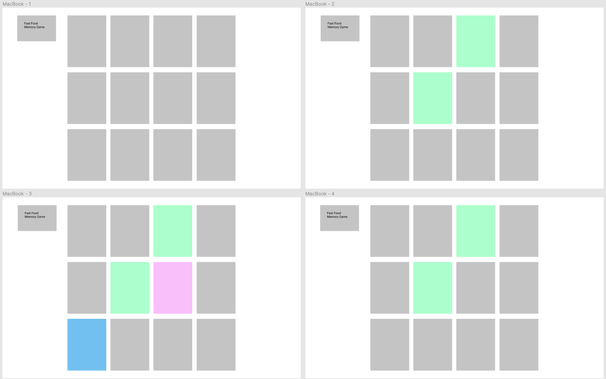

# SEI-629-Project-One-Game

## Game: Fast Food Memory

### User Stories / Game Logic:

- User sees the back of 12 cards in browser 
- Turn over all cards for user to get a quick view before only back sides of cards are in view
- User is able to click on back of two cards one at a time to find a matching pair
- As user clicks on back of two cards, each card will flip over and reveal the face of the card
    - If the two flipped cards are a matching pair, they will remain flipped up
    - If the two flipped cards are not a matching pair, they will flip back over to show the back side of the cards
- User will continue to flip over cards (two at a time) and once all have been matched the game is over
- Message the user the game is over and ask to play again
    - If user agrees to play again, cards reset (moved to new positions and turned over to show back side of cards)
    - If user doesn't want to play again, say goodbye
    
### Other Considerations:
- Add a timer for user to play against and find all matching pairs within alloted time
- Create additional rounds with more cards each round for user to match
- Add match found counter (counts throughout each round how many matches found)
- Responsive to different size browsers and devices

### Wireframes:

### Technology:
- HTML, CSS, Javascript
